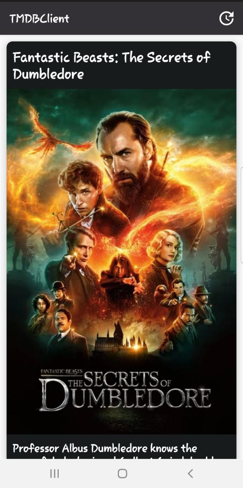
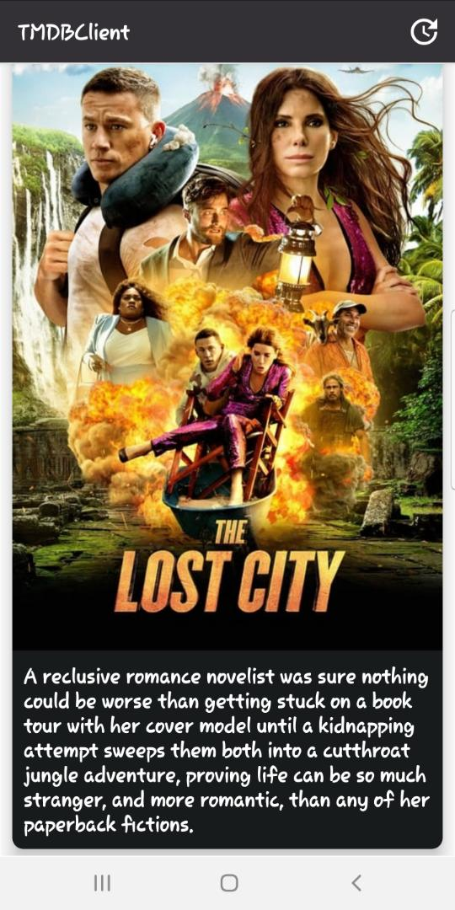
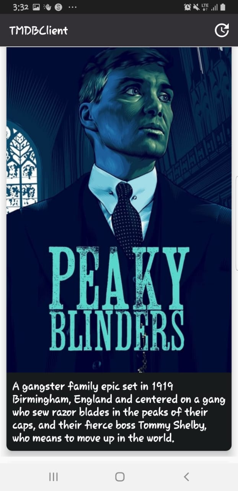
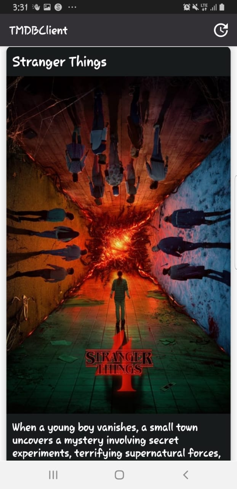
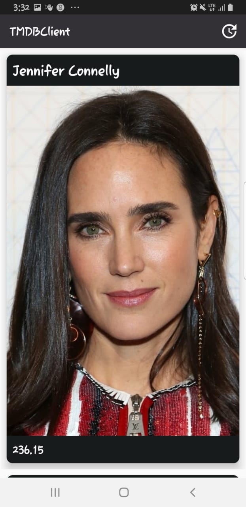
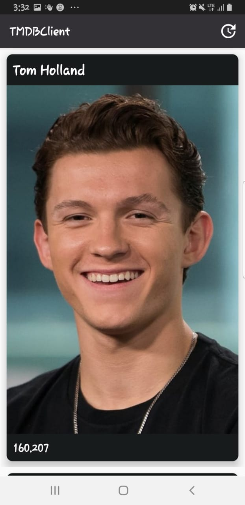

# TMDBClient: A Movie, TV Shows and Celebrity Update Mobile App

## Setup
- Fork the project.
- Clone your own forked repository, run `git clone "https://github.com/[your_github_username]/zc_app_android.git"`
- Run on Android Studio, Enjoy!!

This project follows the Clean Architecture, is based on the MVVM model and is organized according to the following packages:

### data layer
## api
This contains logic concerning interaction to the remote api, including model classes (for holding serialized objects such as json) used for the client-server communication.

## db
This contains any logic relating to creating, reading, writing, updating, and securing the database.

### domain layer
This is a contract between the data layer and the presentation layer and contains all the use cases of the application and the repository

## repository
The repository servers as a single source of truth for accessing data resources. All app related data is exposed to the UI through the repository.

### presentation layer
This is where any logic related to the user interface is placed including android framework related classes eg. Activities, Fragments, Adapters, View Models etc

### dependency injection
This is holds any logic or definition for dependency injection.

## Stack
Retrofit, Room, Dagger2, Kotlin Coroutines and other Android Jetpack libraries

## Movies 

## TvShows  

## Celebrities  

